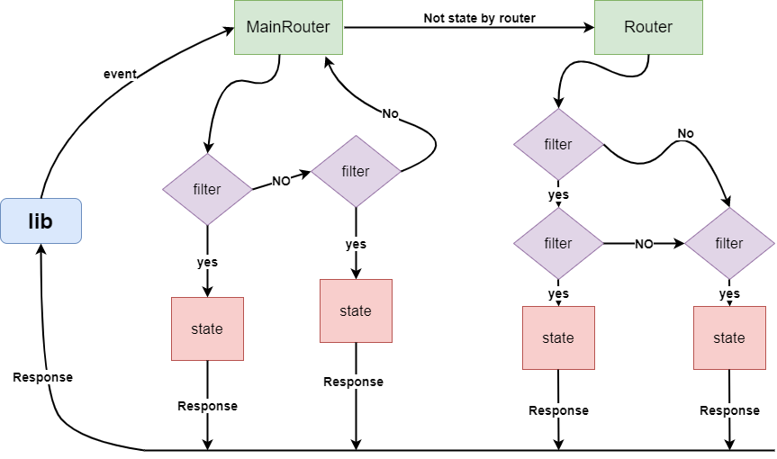
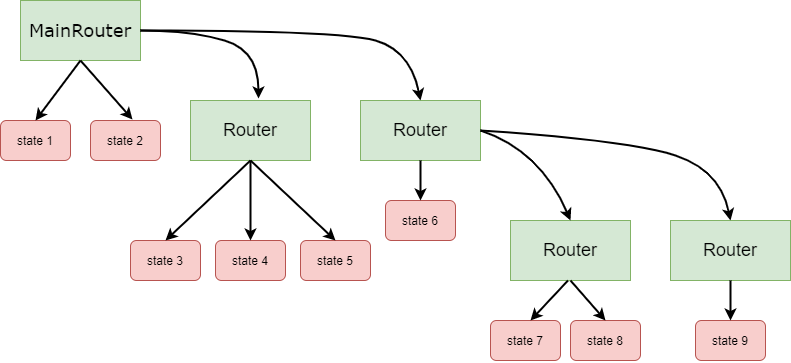

# StateManager - fsm for people
> Convenient FSM implementation for telegram/vk

[Russian version](https://github.com/Bloodielie/state_manager/tree/master/README_ru.md)
___
## Installation
`Supports python3.8+`

Library only
```sh
pip install state-manager
```
Library and vkwave
```sh
pip install state-manager[vk]
```
Library and aiogram
```sh
pip install state-manager[telegram]
```
Full installation
```sh
pip install state-manager[full]
```

## Examples

[VkWave](https://github.com/fscdev/vkwave)
```python
from vkwave.bots import SimpleLongPollBot
import logging
from state_manager import VkWaveMainRouter, VkWaveStateManager

logging.basicConfig(level=logging.INFO)

bot = SimpleLongPollBot(tokens="your token", group_id=123123,)
main_state = VkWaveMainRouter(bot)

@main_state.message_handler()
async def home(event: bot.SimpleBotEvent, state_manager: VkWaveStateManager):
    await event.answer("go to home2")
    await state_manager.set_next_state("home2")

@main_state.message_handler()
async def home2(event: bot.SimpleBotEvent, state_manager: VkWaveStateManager):
    await event.answer("go to home")
    await state_manager.back_to_pre_state()

main_state.install()
bot.run_forever(ignore_errors=True)
```
[Aiogram](https://github.com/aiogram/aiogram/)
```python
import logging
from aiogram import Bot, Dispatcher, executor, types
from state_manager import AiogramStateManager
from state_manager.routes.aiogram import AiogramMainRouter

logging.basicConfig(level=logging.INFO)

bot = Bot(token='your token')
dp = Dispatcher(bot)
main_state = AiogramMainRouter(dp)
main_state.install()

@main_state.message_handler()
async def home(msg: types.Message, state_manager: AiogramStateManager):
    await msg.answer("go to home2")
    await state_manager.set_next_state("home2")

@main_state.message_handler()
async def home2(msg: types.Message, state_manager: AiogramStateManager):
    await msg.answer("go to home")
    await state_manager.set_next_state("home")

executor.start_polling(dp, skip_updates=True)
```
[more examples](https://github.com/Bloodielie/state_manager/tree/master/examples)

## Architecture

**Search state in routers**


___
**Router architecture**


